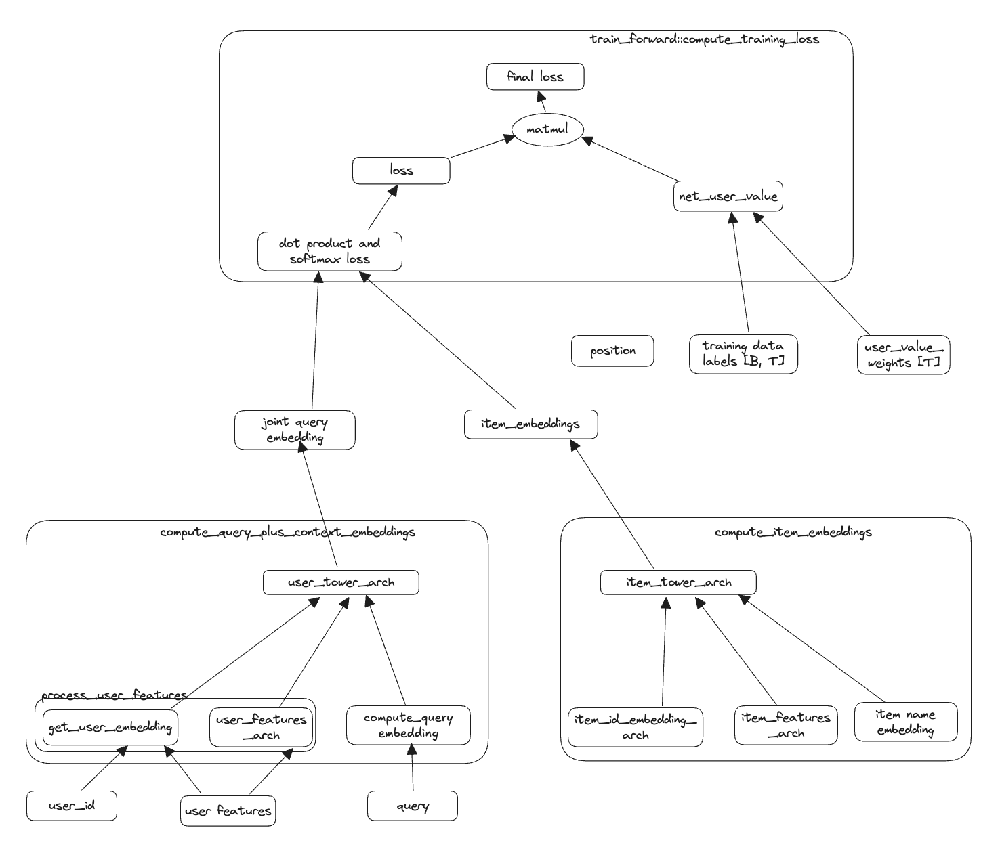
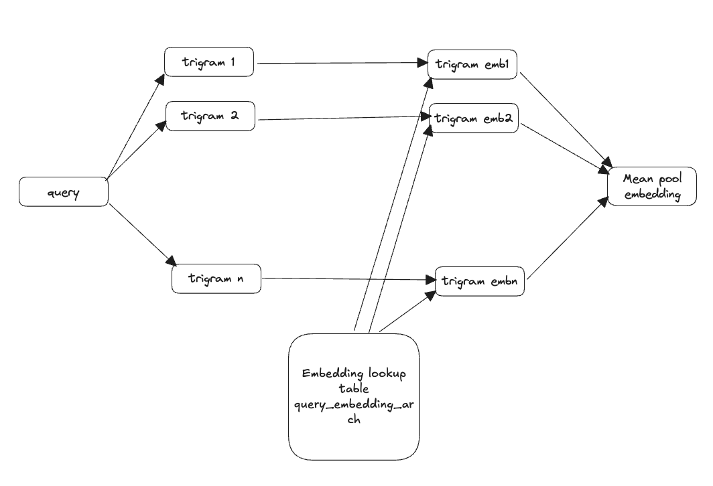

# joint_search_recommendation_retrieval

We demonstrate an extension of two tower models for recommendation that work jointly for search and recommendation

In https://github.com/gauravchak/two_tower_models we had demonstrated how to build models to train embeddings powering personalized recommendations. In this respository we will demonstrate how to train models that can perform retrieval for both search and recommendations.

# Overall design

## How we are processing query to get embeddings

